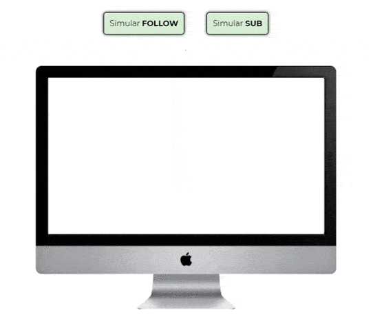

# SE.widget.eventsvgexpanded
Widget for StreamElements. Displays last event svg expanded from center.

---

---

In `public` folder there is the widget.  in `src` folder there is the code to test and develop the widget.
